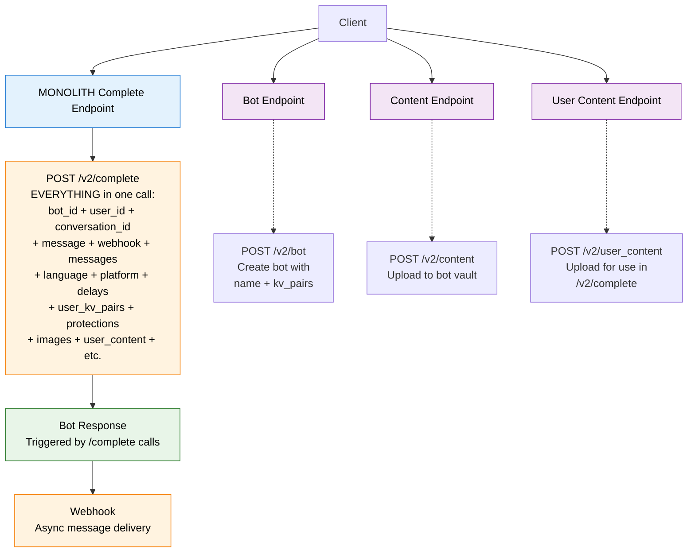

---

# V1 Architecture: Monolithic Action-Based

**V1 Pattern - Action-Based:**
- `/v2/complete` - Add message + generate response in one call
- **Stateless conversations** - client manages conversation history
- **Action-oriented** - generating messages is triggered via `/v2/complete`
- Almost **everything passed to `/v2/complete`** - bot_id, user_id, conversation_id, webhook, messages, delays, etc.
- Webhook for async responses

