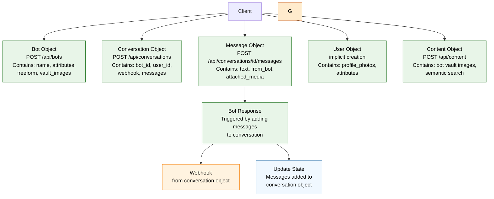

---

# V3 Architecture: Object-Oriented CRUD-Based

**V3 Pattern - CRUD-Based:**
- New endpoints: `/api/bots`, `/api/conversations`, `/api/messages`, `/api/users`, `/api/content`
- **Stateful conversations** - server manages conversation history
- **Resource-oriented** - generating bot messages is triggered by adding user messages

**Object Data Distribution:**
- **bot_id, user_id, webhook, delay, language, etc** → stored in **Conversation Object**
- **Unified content resource**. No more /user_content or /content confusion. you can represent all images either via url or unified id. Which can then be used in:
  - **images in conversation** → stored in **Message Objects** (attached_media)
  - **profile photos** → stored in respective **User/Bot Objects**
  - **secret photos** → stored in **Bot Object**

