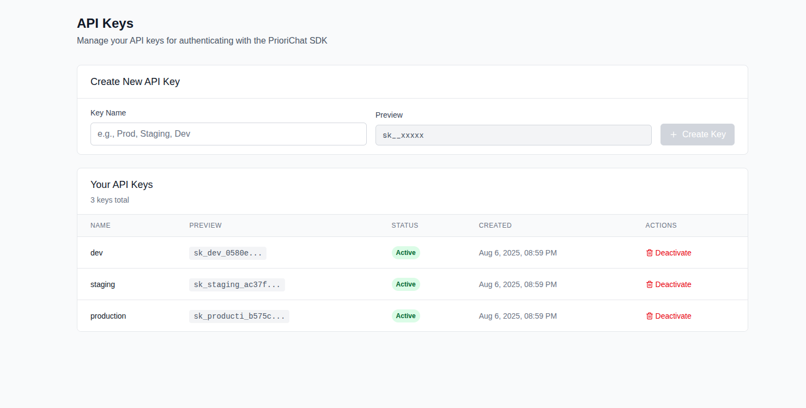

# Authentication: Mostly the Same

<div class="grid grid-cols-2 gap-6 text-sm">

<div>

## V1 & V3 Authentication - Identical Pattern
```javascript
// Both V1 and V3 use the same Bearer token pattern
const response = await fetch('/v2/complete', { // or /api/conversations
  method: 'POST',
  headers: {
    'Authorization': `Bearer ${token}`,
    'Content-Type': 'application/json'
  },
  body: JSON.stringify({...})
});
```

**Authentication Pattern:**
- Same Bearer token in both versions
- Same `Authorization` header format
- Same token usage in requests
- **No changes needed** for existing authentication code

</div>

<div>

## V3 NEW: Portal API Key Generation

<div class="text-center">
  
  <div class="text-xs mt-2 opacity-75">Screenshot: API Key Management Portal</div>
</div>

**New in V3:**
- Self-service **portal-based key generation** (shown above)
- Key naming and organization
- Visual key management interface
- **Same tokens** - just easier to generate

</div>

</div>

<div class="mt-6 p-4 bg-blue-100 border-l-4 border-blue-500 text-blue-700 text-sm">
  <strong>Migration Impact:</strong> <strong>Generate new API key via V3 portal</strong> - same Bearer token pattern, but new key required from portal
</div>
