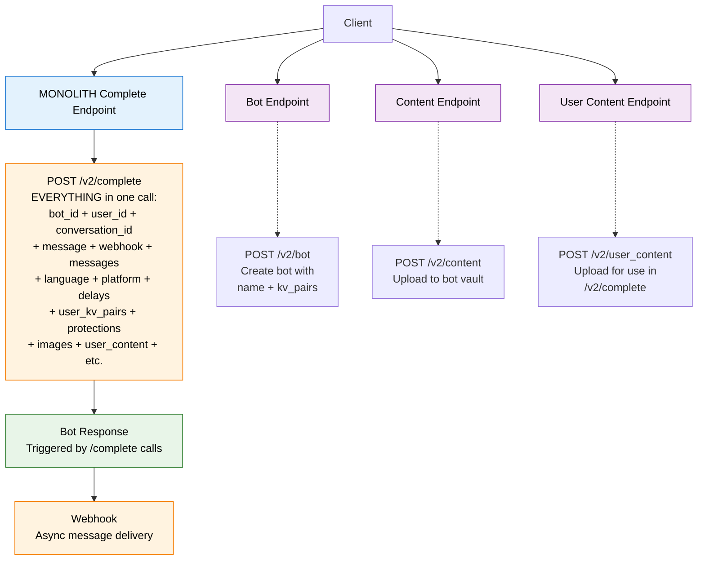
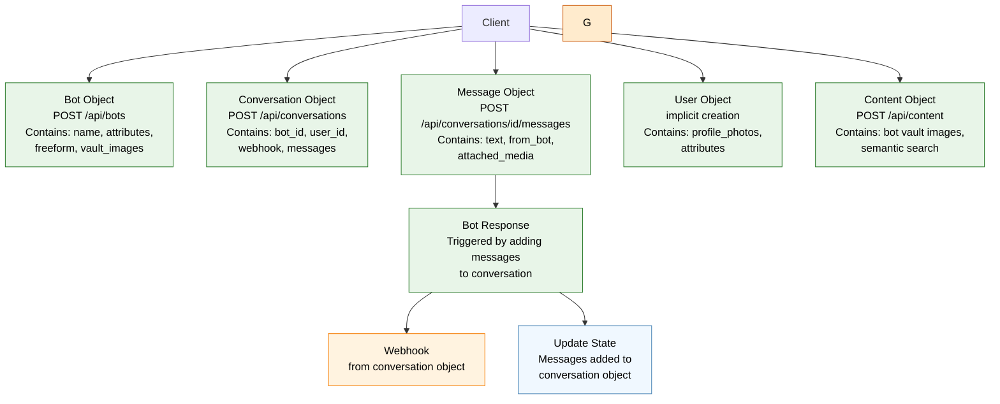

<style>
h1 { @apply text-2xl !important; }
h2 { @apply text-lg !important; }
h3 { @apply text-base !important; }
h4 { @apply text-sm !important; }
.slidev-layout h1 { @apply text-2xl !important; }
.slidev-layout h2 { @apply text-lg !important; }
.slidev-layout h3 { @apply text-base !important; }
</style>

# Chat API Migration Guide

From V1 (/v2/complete) to V3 (/api/...)

<div class="pt-12">
  <span @click="$slidev.nav.next" class="px-2 py-1 rounded cursor-pointer" hover:bg="white hover:bg-opacity-10">
    Single Endpoint → REST Architecture <carbon:arrow-right class="inline"/>
  </span>
</div>

<div class="abs-br m-6 flex gap-2">
  <button @click="$slidev.nav.openInEditor()" title="Open in Editor" class="text-xl slidev-icon-btn opacity-50 !border-none !hover:text-white">
    <carbon:edit />
  </button>
  <a href="https://github.com/slidevjs/slidev" target="_blank" alt="GitHub" title="Open in GitHub" class="text-xl slidev-icon-btn opacity-50 !border-none !hover:text-white">
    <carbon:logo-github />
  </a>
</div>

---
transition: fade-out
---

# Executive Summary

<v-clicks>

- **Architecture Shift**: Single endpoint `/v2/complete` → Multiple REST endpoints `/api/...`
- **State Management**: Stateless → Stateful conversations  
- **Message Flow**: Send full context each time → Create conversation once, add messages
- **Naming Clarification**: V1 API uses `/v2/complete`, V3 API uses `/api/...` routes

</v-clicks>

<div v-click class="mt-8 p-4 bg-red-100 border-l-4 border-red-500 text-red-700">
  <strong>Important:</strong> Some V1 features are not yet available in V3 - migration planning required
</div>

---

# V1 Architecture: Monolithic Action-Based

<div class="grid grid-cols-2 gap-6">

<div>



</div>

<div>

**V1 Pattern - Action-Based:**
- `/v2/complete` - Add message + generate response in one call
- **Stateless conversations** - client manages conversation history
- **Action-oriented** - generating messages is triggered via `/v2/complete`
- Almost **everything passed to `/v2/complete`** - bot_id, user_id, conversation_id, webhook, messages, delays, etc.
- Webhook for async responses

</div>

</div>

---

# V3 Architecture: Object-Oriented CRUD-Based

<div class="grid grid-cols-2 gap-6">

<div>



<div class="text-xs">

**V3 Pattern - CRUD-Based:**
- New endpoints: `/api/bots`, `/api/conversations`, `/api/messages`, `/api/users`, `/api/content`
- **Stateful conversations** - server manages conversation history
- **Resource-oriented** - generating bot messages is triggered by adding user messages

</div>

</div>

<div class="text-sm mt-30">

**Object Data Distribution:**
- **bot_id, user_id, webhook, delay, language, etc** → stored in **Conversation Object**
- **Unified content resource**. No more /user_content or /content confusion. you can represent all images either via url or unified id. Which can then be used in:
  - **images in conversation** → stored in **Message Objects** (attached_media)
  - **profile photos** → stored in respective **User/Bot Objects**
  - **secret photos** → stored in **Bot Object**

</div>

</div>

---
transition: slide-up
---

# Authentication: Mostly the Same

<div class="grid grid-cols-2 gap-6 text-sm">

<div>

## V1 & V3 Authentication - Identical Pattern
```javascript
// Both V1 and V3 use the same Bearer token pattern
const response = await fetch('/v2/complete', { // or /api/conversations
  method: 'POST',
  headers: {
    'Authorization': `Bearer ${token}`,
    'Content-Type': 'application/json'
  },
  body: JSON.stringify({...})
});
```

**Authentication Pattern:**
- Same Bearer token in both versions
- Same `Authorization` header format
- Same token usage in requests
- **No changes needed** for existing authentication code

</div>

<div>

## V3 NEW: Portal API Key Generation

<div class="text-center">
  <!--  -->
  <div class="text-xs mt-2 opacity-75">Screenshot: API Key Management Portal</div>
</div>

**New in V3:**
- **Portal-based key generation** (shown above)
- Self-service API key creation
- Key naming and organization
- Visual key management interface
- **Same tokens** - just easier to generate

</div>

</div>

<div class="mt-6 p-4 bg-blue-100 border-l-4 border-blue-500 text-blue-700 text-sm">
  <strong>Migration Impact:</strong> <strong>Generate new API key via V3 portal</strong> - same Bearer token pattern, but new key required from portal
</div>

---

# Bot Creation Migration

<div class="grid grid-cols-2 gap-4 text-sm">

<div>

## V1 Bot Creation
```javascript
POST /v2/bot
{
  "name": "Angela",
  "freeform_personality": "Angela likes to talk about the weather and travel",
  "kv_pairs": {
    "age": "35",
    "residence": "Calgary", 
    "hair": "blonde",
    "body": "curvy"
  }
}
```

</div>

<div>

## V3 Bot Creation  
```javascript
POST /api/bots
{
  "name": "Angela",
  "freeform": "Angela likes to talk about the weather and travel", 
  "attributes": [
    {"name": "age", "value": "35"},
    {"name": "residence", "value": "Calgary"},
    {"name": "hair", "value": "blonde"},
    {"name": "body", "value": "curvy"}
  ]
}
```


</div>

</div>


<div class="mt-4 p-3 bg-blue-100 border-l-4 border-blue-500 text-blue-700 text-sm">
  <strong>Key Changes:</strong> <span class="bg-gray-200 text-gray-800 px-1 rounded">kv_pairs</span> object → <span class="bg-gray-200 text-gray-800 px-1 rounded">attributes</span> array </div>

<div class="mt-2 p-3 bg-green-100 border-l-4 border-green-500 text-green-700 text-sm">
  <strong>Migration Support:</strong> Existing bots can be migrated for you - contact us to transfer your V1 bots to V3 format
</div>

---
layout: two-cols
layoutClass: gap-8
---

# Message Generation: V1 Complete Flow

::left::

<div class="text-sm">

**Single Request Pattern**
```javascript
POST /v2/complete
{
  "conversation_id": "chat-57-10628047-21400194",
  "bot_id": "88d86507-8d6c-4fad-b6f6-15d4fd377c83",
  "message": "Hola",
  "messages": [
    {
      "bot": true,
      "content": ["Hey sexy, what's up?"]
    },
    {
      "bot": false, 
      "content": ["not much, you?"]
    }
  ],
  "user_id": "306066b7-e47a-405b-8726-ccec362858ac",
  "webhook": "https://api.example.com/webhook",
  "language": "es",
  "platform": "Qkkie",
  "user_kv_pairs": {"age": 30}
}
```

</div>

::right::

<div class="text-sm">

**Response & Characteristics**
- 🔄 **Stateless**: Full conversation sent each time
- ⚡ **Immediate**: Synchronous completion 
- 🌍 **Rich Context**: Language, platform, user data
- ⏱️ **Timing Control**: min_delay, max_delay
- 🎭 **Personality**: Grammar degradation, tone control
- 📱 **Platform-Aware**: Tinder, Qkkie, etc.

</div>

<div v-click class="mt-4 p-3 bg-yellow-100 border-l-4 border-yellow-500 text-yellow-700 text-sm">
  <strong>Note:</strong> Many of these features are not available in V3 yet
</div>

---

# Message Generation: V1 Single Request Flow

<div class="grid grid-cols-2 gap-6 text-sm">

<div>

## V1 Complete Request
```javascript
POST /v2/complete
{
  "bot_id": "88d86507-8d6c-4fad-b6f6-15d4fd377c83",
  "user_id": "306066b7-e47a-405b-8726-ccec362858ac",
  "conversation_id": "chat-123",
  "message": "Hola",
  "messages": [
    {
      "bot": true,
      "content": ["Hey there!"]
    }
  ],
  "webhook": "https://api.example.com/webhook",
  "language": "es",
  "platform": "Qkkie",
  "min_delay": 30,
  "max_delay": 60,
  "user_kv_pairs": {"age": 25}
}
```

</div>

<div>

## V1 Characteristics
- **🔥 Single endpoint** - everything in one request
- **📦 Stateless** - full context sent each time
- **⚡ Rich context** - language, platform, timing, user data
- **🎯 Direct response** - immediate or webhook
- **🛠️ Full feature set** - all parameters available

</div>

</div>

---

# V1 Flow

<style>
pre code { font-size: 9px !important; }
</style>

<div class="grid grid-cols-2 gap-4 text-xs">

<div style="position: relative; height: 400px; overflow: hidden;">

<!-- V1 Complete Request -->
<div class="absolute w-full transition-transform duration-700 ease-in-out" 
     style="top: 0px;">

**Single Request: Complete** <span v-show="$slidev.nav.clicks >= 1" style="color: #16a34a;">✓ 📤</span>
<div style="font-size: 10px; margin-top: -14px;">

<div class="bg-gray-100 p-3 rounded text-xs font-mono text-black" v-bind:style="$slidev.nav.clicks === 1 ? 'background-color: #dcfce7; border: 2px solid #16a34a;' : ''">
POST /v2/complete<br/>
{<br/>
&nbsp;&nbsp;"bot_id": "88d86507-8d6c-4fad-b6f6-15d4fd377c83",<br/>
&nbsp;&nbsp;"user_id": "306066b7-e47a-405b-8726-ccec362858ac",<br/>
&nbsp;&nbsp;"conversation_id": "f47ac10b...",<br/>
&nbsp;&nbsp;"message": "Hello",<br/>
&nbsp;&nbsp;"webhook": "https://api.example.com/webhook",<br/>
&nbsp;&nbsp;"messages": [<br/>
&nbsp;&nbsp;&nbsp;&nbsp;{"bot": true, "content": ["Hi! How are you?"]}<br/>
&nbsp;&nbsp;],<br/>
&nbsp;&nbsp;"language": "en",<br/>
&nbsp;&nbsp;"platform": "Web",<br/>
&nbsp;&nbsp;"user_kv_pairs": {"age": 25}<br/>
}
</div>

</div>

</div>

</div>

<div>

<div v-click="2" v-show="$slidev.nav.clicks === 2" class="mt-2 text-center p-3 rounded text-black" style="background-color: #fef3c7; border: 2px solid #f59e0b;">
🤖 <strong>Bot processing message...</strong>
</div>

<div v-click="3" class="mt-2">

**Webhook Received**
<div class="bg-gray-100 p-3 rounded text-xs font-mono text-black">
{<br/>
&nbsp;&nbsp;"completion": ["Hi! Nice to meet you!"],<br/>
&nbsp;&nbsp;"id": "b2c3d4e5-f6a7-8901-bcde-f23456789012",<br/>
&nbsp;&nbsp;"media": null,<br/>
&nbsp;&nbsp;"media_id": null<br/>
}
</div>

</div>

<div v-click="3" class="mt-2 text-center p-3 rounded text-black" style="background-color: #dcfce7; border: 2px solid #16a34a;">
✅ <strong>Complete! Bot response generated and returned</strong> 🎯
</div>

</div>

</div>

---

# V3 Flow

<style>
pre code { font-size: 9px !important; }
</style>

<div class="grid grid-cols-2 gap-4 text-xs">

<div style="position: relative; height: 400px; overflow: hidden;">

<!-- Step 1: Create Conversation -->
<div class="absolute w-full transition-transform duration-700 ease-in-out" 
     style="top: 0px;"
     v-bind:style="`transform: translateY(${$slidev.nav.clicks >= 6 ? '-180px' : '0px'})`">

**Step 1: Create Conversation** <span v-show="$slidev.nav.clicks >= 1" style="color: #16a34a;">✓ 📤</span>
<div style="font-size: 10px; margin-top: -14px;">

<div class="bg-gray-100 p-3 rounded text-xs font-mono text-black" v-bind:style="$slidev.nav.clicks === 1 ? 'background-color: #dcfce7; border: 2px solid #16a34a;' : ''">
POST /api/conversations<br/>
{<br/>
&nbsp;&nbsp;"bot_id": "88d86507-8d6c-4fad-b6f6-15d4fd377c83",<br/>
&nbsp;&nbsp;"user_id": "306066b7-e47a-405b-8726-ccec362858ac",<br/>
&nbsp;&nbsp;"create_user_if_not_exists": true,<br/>
&nbsp;&nbsp;"webhook": "https://api.example.com/webhook"<br/>
}
</div>

</div>

</div>

<!-- Step 2: Send Message -->
<div v-click="2" class="absolute w-full transition-transform duration-700 ease-in-out" 
     style="top: 180px;"
     v-bind:style="`transform: translateY(${$slidev.nav.clicks >= 6 ? '-180px' : '0px'})`">

**Step 2: Send Message** <span v-show="$slidev.nav.clicks >= 4" style="color: #16a34a;">✓ 📤</span>
<div class="text-xs" style="margin-top: -14px;">

<div class="bg-gray-100 p-3 rounded text-xs font-mono text-black" v-bind:style="$slidev.nav.clicks === 4 ? 'background-color: #dcfce7; border: 2px solid #16a34a;' : ''">
POST /api/conversations/<span v-mark="{ at: 3, color: '#DC2626', type: 'underline' }" style="font-weight: bold; color: #DC2626;">f47ac10b...</span>/messages<br/>
{<br/>
&nbsp;&nbsp;<span style="background-color: #DBEAFE; padding: 2px 4px; border-radius: 3px;">"message": {<br/>
&nbsp;&nbsp;&nbsp;&nbsp;"text": "Hello",<br/>
&nbsp;&nbsp;&nbsp;&nbsp;<span style="font-weight: bold;">"from_bot": false</span>,<br/>
&nbsp;&nbsp;&nbsp;&nbsp;"attached_media": null<br/>
&nbsp;&nbsp;}</span><br/>
}
</div>

</div>

</div>

<!-- Step 3: Webhook Received -->
<div v-click="6" class="absolute w-full transition-transform duration-700 ease-in-out" 
     style="top: 360px;"
     v-bind:style="`transform: translateY(${$slidev.nav.clicks >= 6 ? '-180px' : '0px'})`">

**Step 3: Webhook Received**
<div class="text-xs" style="margin-top: -14px;">

<div class="bg-gray-100 p-3 rounded text-xs font-mono text-black">
{<br/>
&nbsp;&nbsp;"event": "message.created",<br/>
&nbsp;&nbsp;"conversation_id": <span style="font-weight: bold; color: #DC2626;">"f47ac10b..."</span>,<br/>
&nbsp;&nbsp;<span style="background-color: #FED7AA; padding: 2px 4px; border-radius: 3px;">"message": {<br/>
&nbsp;&nbsp;&nbsp;&nbsp;"id": "b2c3d4e5-f6a7-8901-bcde-f23456789012",<br/>
&nbsp;&nbsp;&nbsp;&nbsp;"text": "Hi! How are you?",<br/>
&nbsp;&nbsp;&nbsp;&nbsp;<span style="font-weight: bold;">"from_bot": true</span>,<br/>
&nbsp;&nbsp;&nbsp;&nbsp;"sent_at": 1640995205,<br/>
&nbsp;&nbsp;&nbsp;&nbsp;"message_tone": "Friendly"<br/>
&nbsp;&nbsp;}</span><br/>
}
</div>

</div>

</div>

</div>

<div>

<div v-click="1" class="mt-2">

**Conversation State**
<div class="bg-gray-100 p-3 rounded text-xs font-mono text-black">
{<br/>
&nbsp;&nbsp;"id": <span v-mark="{ at: 3, color: '#DC2626', type: 'underline' }" style="font-weight: bold; color: #DC2626;">"f47ac10b..."</span>,<br/>
&nbsp;&nbsp;"bot_id": "88d86507-8d6c-4fad-b6f6-15d4fd377c83",<br/>
&nbsp;&nbsp;"user_id": "306066b7-e47a-405b-8726-ccec362858ac",<br/>
&nbsp;&nbsp;"webhook": "https://api.example.com/webhook",<br/>
&nbsp;&nbsp;"messages": [<span v-click="4" style="opacity: 0; position: absolute;" v-bind:style="$slidev.nav.clicks >= 4 ? 'position: static; opacity: 1;' : ''"><br/>
&nbsp;&nbsp;&nbsp;&nbsp;<span style="background-color: #DBEAFE; padding: 2px 4px; border-radius: 3px;">{<br/>
&nbsp;&nbsp;&nbsp;&nbsp;&nbsp;&nbsp;"id": "a1b2c3d4-e5f6-7890-abcd-ef1234567890",<br/>
&nbsp;&nbsp;&nbsp;&nbsp;&nbsp;&nbsp;"text": "Hello",<br/>
&nbsp;&nbsp;&nbsp;&nbsp;&nbsp;&nbsp;<span style="font-weight: bold;">"from_bot": false</span>,<br/>
&nbsp;&nbsp;&nbsp;&nbsp;&nbsp;&nbsp;"sent_at": 1640995200<br/>
&nbsp;&nbsp;&nbsp;&nbsp;}</span></span><span v-click="6" style="opacity: 0; position: absolute;" v-bind:style="$slidev.nav.clicks >= 6 ? 'position: static; opacity: 1;' : ''">,<br/>
&nbsp;&nbsp;&nbsp;&nbsp;<span style="background-color: #FED7AA; padding: 2px 4px; border-radius: 3px;">{<br/>
&nbsp;&nbsp;&nbsp;&nbsp;&nbsp;&nbsp;"id": "b2c3d4e5-f6a7-8901-bcde-f23456789012",<br/>
&nbsp;&nbsp;&nbsp;&nbsp;&nbsp;&nbsp;"text": "Hi! How are you?",<br/>
&nbsp;&nbsp;&nbsp;&nbsp;&nbsp;&nbsp;<span style="font-weight: bold;">"from_bot": true</span>,<br/>
&nbsp;&nbsp;&nbsp;&nbsp;&nbsp;&nbsp;"sent_at": 1640995205,<br/>
&nbsp;&nbsp;&nbsp;&nbsp;&nbsp;&nbsp;"message_tone": "Friendly"<br/>
&nbsp;&nbsp;&nbsp;&nbsp;}</span></span><br/>
&nbsp;&nbsp;]<br/>
}
</div>

</div>

<div v-click="5" class="mt-2 text-center p-3 rounded text-black" v-bind:style="$slidev.nav.clicks === 6 ? 'background-color: #dcfce7; border: 2px solid #16a34a;' : 'background-color: #fef3c7; border: 2px solid #f59e0b;'">
<span v-show="$slidev.nav.clicks === 5">🤖 <strong>New user message detected, bot generating...</strong></span>
<span v-show="$slidev.nav.clicks >= 6">✅ <strong>AI msg generated! Sent webhook, added message to history</strong> 📤</span>
</div>


</div>

</div>

---

# V1 Segmentation vs V3 Atomic Messages

<style>
pre code { font-size: 8px !important; line-height: 1.0 !important; }
.compact-box h2 { margin: 0 !important; padding: 0 !important; }
.compact-box p { margin: 0 !important; }
.compact-box ul { margin: 0 !important; padding-left: 1rem !important; }
</style>

<div class="grid grid-cols-2 gap-4 text-xs">

<div>

**V1 message segmentation:** Messages as Arrays of Segments

```javascript
// V1 uses arrays of strings for messages
{
  "message": "Hello there!",
  "messages": [
    { "bot": true, "content": ["Hi! How are you doing today?", "I was just thinking about you.", "What are your plans for tonight?"] },
    { "bot": false, "content": ["Hey!", "I'm doing great, thanks for asking."] },
    { "bot": true, "content": ["That's wonderful to hear!", "I'm glad you're having a good day."] }
  ]
}
```

</div>

<div>

**V3 atomic messages**: 1 Message = 1 Text String, more standard pattern

```javascript
// V3 uses single text strings per message - just pass what the user sees!
{ "with_messages": [
    { "text": "Hi! How are you doing today?", "from_bot": true },
    { "text": "I was just thinking about you.", "from_bot": true },
    { "text": "What are your plans for tonight?", "from_bot": true },
    { "text": "Hey!", "from_bot": false },
    { "text": "I'm doing great, thanks for asking.", "from_bot": false },
    { "text": "That's wonderful to hear!", "from_bot": true },
    { "text": "I'm glad you're having a good day.", "from_bot": true }
  ]
}

```

</div>

</div>

<div class="mt-2 grid grid-cols-2 gap-4 text-xs">

<div class="compact-box p-2 bg-red-50 border-l-4 border-red-500 text-red-900">

**V1 Segmentation Complexity:**
- Bot responses arrays of strings
- Each segment represents a "part" of the message
- Delay between segments must be done on your side
- Impossible for the user to interrupt the bot between segments


</div>

<div class="compact-box p-2 bg-green-50 border-l-4 border-green-500 text-green-900">

**V3 Atomic Simplicity:**
- 1 message = 1 webhook payload = 1 atomic text string
- Bot and user can still send multiple messages, but simpler. No need to worry aboout segmentation on your end
- User can interrupt the bot mid segments

</div>

</div>

<div class="mt-2 p-2 bg-yellow-100 border-l-4 border-yellow-500 text-yellow-700 text-xs">
<strong>Migration Impact:</strong> Should become much simpler, but have to make sure you are handling strings instead of lists of strings on your end.
</div>

---

# V1 vs V3: Content & Image Handling

<style>
pre code { font-size: 7px !important; line-height: 1.0 !important; }
</style>

<div class="grid grid-cols-2 gap-4 text-xs">

<div>

**V1: Multiple Endpoints & Body Types**

```bash
# Bot vault: multipart/form-data
curl -F "content=@image.jpg" "/v2/content?bot_id=uuid"

# User content: raw binary
curl --data-binary "@photo.jpg" "/v2/user_content"
# Response: {"id": "user-content-uuid"}
```

```javascript
// Reference in conversation: JSON
POST /v2/complete
{
  "message": "Here's my photo",
  "image_id": "user-content-uuid",
  // OR "image_url": "https://url.jpg"
  // OR "user_images": ["profile-img-id"]
  "chat_images_enabled": true // Bot can use vault
}
```

**Problems:**
- 3 different body types (multipart, binary, JSON)
- 2-step process for user images
- Multiple ways to reference content

</div>

<div>

**V3: Unified JSON Approach**

```javascript
// Bot vault: JSON
POST /api/content
{ "image_url": "https://url.jpg", "bot_id": "uuid" }

// User content: direct message attachment
POST /api/conversations/conv-123/messages
{
  "message": {
    "text": "Here's my photo",
    "attached_media": { "url": "https://photo.jpg" }
  }
}

// Bot can search/use vault content automatically
```

**Benefits:**
- Single JSON format across all endpoints
- Direct attachment, no upload-then-reference
- One consistent way to handle content
- URL-based, cloud-native approach

</div>

</div>

<div class="mt-2 grid grid-cols-2 gap-4 text-xs">

<div class="p-2 bg-red-50 border-l-4 border-red-500 text-red-900">
**V1:** Multipart forms + raw binary + JSON = complex client code
</div>

<div class="p-2 bg-green-50 border-l-4 border-green-500 text-green-900">
**V3:** JSON everywhere = simplified HTTP client implementation
</div>

</div>


---

# V1 Request Structure Deep Dive

<div class="text-sm">

Real example from production system:

```javascript {all|3-4|5-6|7-17|18-23|24-29|30-35|all}
{
  // Core identifiers
  "bot_id": "88d86507-8d6c-4fad-b6f6-15d4fd377c83",
  "conversation_id": "chat-57-10628047-21400194",
  "user_id": "306066b7-e47a-405b-8726-ccec362858ac",
  "message": "Hola",

  // Conversation history (full context each time)
  "messages": [
    {
      "bot": true,
      "content": ["Ehh la verdad mi mayor fantasía es tener sexo anal..."]
    },
    {
      "bot": true, 
      "content": ["Que prefieres, tratarme como una reina delicada..."]
    }
  ],

  // Platform and localization
  "platform": "Qkkie",
  "language": "es", 
  "timezone": null,

  // Timing and behavior control
  "min_delay": 30,
  "max_delay": 60,
  "degrade_grammar": 1.0,
  "enable_protections": true,

  // User context and personalization  
  "user_kv_pairs": {"age": 30},
  "user_display_name": null,
  "bot_display_name": null,

  // Webhook for async responses
  "webhook": "https://api.qkkie.com/chat/clonetwin/messages?token=..."
}
```

</div>

---

# V1 vs V3 Request Structure Comparison

<div class="grid grid-cols-2 gap-4 text-xs">

<div>

## V1 - Everything in One Request
```javascript
POST /v2/complete
{
  "bot_id": "88d86507-8d6c-4fad-b6f6-15d4fd377c83",
  "conversation_id": "chat-57-10628047-21400194", 
  "user_id": "306066b7-e47a-405b-8726-ccec362858ac",
  "message": "Hola",
  "messages": [...], // Full conversation history
  "platform": "Qkkie",
  "language": "es", 
  "timezone": "Europe/Madrid",
  "min_delay": 30,
  "max_delay": 60,
  "degrade_grammar": 1.0,
  "user_kv_pairs": {"age": 30},
  "user_display_name": "Max",
  "bot_display_name": "Angela",
  "enable_protections": true,
  "question_mode": "enabled",
  "webhook": "https://api.qkkie.com/webhook"
}
```

**V1 Pattern:**
- Single request with full context
- Rich metadata and personalization
- Platform and language awareness
- Timing and behavior controls

</div>

<div>

## V3 - Split into Multiple Requests

**Step 1: Create Conversation**
```javascript
POST /api/conversations
{
  "bot_id": "88d86507-8d6c-4fad-b6f6-15d4fd377c83",
  "user_id": "306066b7-e47a-405b-8726-ccec362858ac",
  "create_user_if_not_exists": true,
  "webhook": "https://api.qkkie.com/webhook",
  "with_messages": [
    {
      "text": "Previous message...",
      "from_bot": true
    }
  ]
}
```

**Step 2: Send Message**
```javascript
POST /api/conversations/conv_abc123/messages
{
  "message": {
    "text": "Hola",
    "from_bot": false,
    "attached_media": null
  }
}
```

**V3 Pattern:**
- Multi-step workflow
- Server-side state management
- ❌ **Missing**: platform, language, timezone
- ❌ **Missing**: timing controls, user context

</div>

</div>

---
layout: two-cols
layoutClass: gap-8
---

# Features Lost in V3 Migration

::left::

## Context & Localization
<div class="text-sm">

```javascript
// V1 Only - Not available in V3
{
  "language": "es",           // ❌ Lost
  "platform": "Qkkie",       // ❌ Lost  
  "timezone": "Europe/Madrid" // ❌ Lost
}
```

</div>

## Timing & Behavior
<div class="text-sm">

```javascript
// V1 Only
{
  "min_delay": 30,           // ❌ Lost
  "max_delay": 60,           // ❌ Lost
  "degrade_grammar": 1.0,    // ❌ Lost  
  "fast_mode": true          // ❌ Lost
}
```

</div>

## User Personalization  
<div class="text-sm">

```javascript
// V1 Only
{
  "user_kv_pairs": {"age": 30},     // ❌ Lost
  "user_freeform": "Looking for...", // ❌ Lost
  "user_display_name": "Max",       // ❌ Lost
  "bot_display_name": "Angela"      // ❌ Lost
}
```

</div>

::right::

## Media Handling
<div class="text-sm">

```javascript
// V1 Only
{
  "image_id": "img_123",           // ❌ Lost
  "image_url": "https://...",      // ❌ Lost
  "user_images": [...],           // ❌ Lost
  "bot_images": [...],            // ❌ Lost
  "chat_images_enabled": true     // ❌ Lost
}
```

</div>

## Protection & Control
<div class="text-sm">

```javascript
// V1 Only  
{
  "enable_protections": true,      // ❌ Lost
  "question_mode": "enabled",      // ❌ Lost
  "follow_up": null,              // ❌ Lost
  "is_follow_up": false           // ❌ Lost
}
```

</div>

<div class="mt-4 p-3 bg-red-100 border-l-4 border-red-500 text-red-700 text-sm">
  <strong>Critical:</strong> These features need alternative solutions or roadmap planning
</div>

---

# Features Gained in V3

<div class="grid grid-cols-2 gap-6">

<div>

## 🗄️ Persistent Storage
<div class="text-sm">

```javascript
// Conversations stored server-side
GET /api/conversations/conv_123
// Returns full message history

// No need to send full context each time
POST /api/conversations/conv_123/messages
```

</div>

## 🧠 Memory System
<div class="text-sm">

```javascript
GET /api/conversations/conv_123/memories
{
  "bot_memories": ["User likes pizza"],
  "user_memories": ["Bot is from NYC"]  
}
```

</div>

## 📁 Content Management
<div class="text-sm">

```javascript
POST /api/content
{
  "bot_id": "bot_123",
  "image_url": "https://example.com/pic.jpg"
}

GET /api/content?search=vacation&media_type=image
```

</div>

</div>

<div>

## 🔍 Advanced Querying
<div class="text-sm">

```javascript
GET /api/conversations?min_messages=5
  &message_content=vacation
  &min_last_message_date=1640995200
```

</div>

## 📊 Rich Metadata
<div class="text-sm">

```javascript
{
  "text": "Hello!",
  "sent_at": 1640995200,
  "message_tone": "Friendly", 
  "moderation": {
    "category": "safe",
    "severity": "Low"
  }
}
```

</div>

## 🔑 API Key Management
<div class="text-sm">

```javascript
POST /api/api-keys {"name": "Production"}
GET /api/api-keys
DELETE /api/api-keys/{key_id}
```

</div>

</div>

</div>

---

# V1 Complete Endpoint - Everything in One Request

<div class="text-sm">

The `/v2/complete` endpoint required **all context** to generate a response:

```javascript
POST /v2/complete
{
  // Required identifiers
  "bot_id": "88d86507-8d6c-4fad-b6f6-15d4fd377c83",      // Which bot personality
  "user_id": "306066b7-e47a-405b-8726-ccec362858ac",     // Which user is messaging
  "conversation_id": "chat-57-10628047-21400194",        // Conversation thread ID
  "message": "Hola",                                      // New message to respond to

  // Complete conversation history (sent every time)
  "messages": [
    {"bot": true, "content": ["Previous bot message 1"]},
    {"bot": false, "content": ["Previous user message"]},
    {"bot": true, "content": ["Previous bot message 2"]}
  ],

  // Response delivery
  "webhook": "https://api.example.com/webhook",           // Where to send bot response

  // Generation behavior controls
  "platform": "Qkkie",                                   // Dating platform context  
  "language": "es",                                       // Response language
  "min_delay": 30,                                       // Minimum response delay
  "max_delay": 60,                                       // Maximum response delay
  "degrade_grammar": 1.0,                                // Grammar imperfection level
  "enable_protections": true,                            // Safety controls

  // User personalization context
  "user_kv_pairs": {"age": 30, "location": "NYC"},      // User attributes
  "user_display_name": "Max",                           // User's display name
  "bot_display_name": "Angela",                         // Bot's display name
  "timezone": "America/New_York"                        // User timezone
}
```

**V1 Pattern**: Every request contained **complete context** - identifiers, full conversation history, generation settings, and delivery instructions.

</div>

---

# Complete Message Generation: V1 vs V3

<div class="grid grid-cols-2 gap-4 text-xs">

<div>

## V1 - Single Request (Production Example)
```javascript
// Real production request to V1 API
const response = await fetch('/v2/complete', {
  method: 'POST',
  headers: {
    'Authorization': 'Bearer sk_prod_abcd1234...',
    'Content-Type': 'application/json'
  },
  body: JSON.stringify({
    "bot_id": "88d86507-8d6c-4fad-b6f6-15d4fd377c83",
    "message": "Hola",
    "user_id": "306066b7-e47a-405b-8726-ccec362858ac",
    "webhook": "https://api.qkkie.com/chat/clonetwin/messages?token=...",
    "language": "es",
    "platform": "Qkkie",
    "messages": [
      {
        "bot": true,
        "content": ["Ehh la verdad mi mayor fantasía..."]
      },
      {
        "bot": true,
        "content": ["Que prefieres, tratarme como una reina..."]
      }
    ],
    "max_delay": 60,
    "min_delay": 30,
    "user_kv_pairs": { "age": 30 },
    "conversation_id": "chat-57-10628047-21400194", 
    "degrade_grammar": 1.0,
    "enable_protections": true,
    "question_mode": null,
    "user_display_name": null,
    "bot_display_name": null
  })
});

// Response: Immediate completion or webhook
```

</div>

<div>

## V3 - Multi-Request Equivalent
```javascript
// Step 1: Create conversation (once)
const conversationResponse = await fetch('/api/conversations', {
  method: 'POST',
  headers: {
    'Authorization': 'Bearer sk_prod_abcd1234...',
    'Content-Type': 'application/json'
  },
  body: JSON.stringify({
    "bot_id": "88d86507-8d6c-4fad-b6f6-15d4fd377c83",
    "user_id": "306066b7-e47a-405b-8726-ccec362858ac",
    "create_user_if_not_exists": true,
    "webhook": "https://api.qkkie.com/webhook",
    "with_messages": [
      {
        "text": "Ehh la verdad mi mayor fantasía...",
        "from_bot": true
      },
      {
        "text": "Que prefieres, tratarme como una reina...",
        "from_bot": true
      }
    ]
  })
});

const { conversation } = await conversationResponse.json();

// Step 2: Send new message (for each message)
const messageResponse = await fetch(
  `/api/conversations/${conversation.id}/messages`, {
  method: 'POST',
  headers: {
    'Authorization': 'Bearer sk_prod_abcd1234...',
    'Content-Type': 'application/json'
  },
  body: JSON.stringify({
    "message": {
      "text": "Hola",
      "from_bot": false,
      "attached_media": null
    }
  })
});

// Response: 202 Accepted, bot response via webhook
```

</div>

</div>

---

# Response Structure: V1 vs V3

<div class="grid grid-cols-2 gap-4 text-sm">

<div>

## V1 Response - Immediate Completion
```javascript
// V1 /v2/complete response
{
  "response": "¡Hola! ¿Cómo estás? Me alegra que me escribas 😊",
  "conversation_id": "chat-57-10628047-21400194",
  "bot_id": "88d86507-8d6c-4fad-b6f6-15d4fd377c83",
  "message_id": "msg_987654",
  "delay": 45, // Actual delay used
  "tone": "friendly",
  "moderation": null,
  "timestamp": 1640995205
}
```

**V1 Response Pattern:**
- Immediate synchronous response
- Contains generated message
- Includes timing information
- Simple, flat structure

</div>

<div>

## V3 Response - Async Acknowledgment
```javascript
// V3 POST /api/conversations/{id}/messages response
// Status: 202 Accepted
{
  // Empty body - processing async
}

// Actual response comes via webhook:
{
  "event": "message.created",
  "conversation_id": "conv_abc123", 
  "bot_id": "88d86507-8d6c-4fad-b6f6-15d4fd377c83",
  "user_id": "306066b7-e47a-405b-8726-ccec362858ac",
  "message": {
    "id": "msg_xyz789",
    "text": "¡Hola! ¿Cómo estás? Me alegra que me escribas 😊",
    "from_bot": true,
    "sent_at": 1640995205,
    "message_tone": "Friendly",
    "moderation": {
      "category": null,
      "severity": "Low"
    },
    "attached_media": null
  },
  "conversation_messages_count": 4
}
```

**V3 Response Pattern:**
- Async acknowledgment (202)
- Rich webhook payload
- Detailed message metadata
- Conversation context included

</div>

</div>

---

# Code Migration: Bot Management Comparison

<div class="grid grid-cols-2 gap-4 text-sm">

<div>

## V1 Bot Management
```javascript
// V1 Bot Creation - Simple object format
const createBot = async (botData) => {
  const response = await fetch('/v2/bot', {
    method: 'POST',
    headers: {
      'Authorization': `Bearer ${token}`,
      'Content-Type': 'application/json'
    },
    body: JSON.stringify({
      name: botData.name,
      freeform_personality: botData.personality,
      kv_pairs: botData.attributes // Object format
    })
  });
  
  return await response.json();
};

// Usage
await createBot({
  name: "Angela",
  personality: "Friendly and outgoing",
  attributes: {
    age: "25",
    location: "NYC"
  }
});
```

**V1 Limitations:**
- Create only, no CRUD operations
- No way to list, update, or delete bots
- Object-based attributes

</div>

<div>

## V3 Bot Management  
```javascript
// V3 Bot Creation - Array format
const createBot = async (botData) => {
  const response = await fetch('/api/bots', {
    method: 'POST',
    headers: {
      'Authorization': `Bearer ${token}`,
      'Content-Type': 'application/json'
    },
    body: JSON.stringify({
      name: botData.name,
      freeform: botData.personality, // Renamed field
      attributes: Object.entries(botData.attributes).map(([name, value]) => ({
        name,
        value: String(value) // Must be strings
      }))
    })
  });
  
  return await response.json();
};

// Full CRUD Operations Available
await fetch(`/api/bots/${botId}`, { method: 'GET' });    // Read
await fetch(`/api/bots/${botId}`, { method: 'PUT', ... }); // Update  
await fetch(`/api/bots/${botId}`, { method: 'DELETE' });   // Delete
await fetch('/api/bots');                                  // List All
```

**V3 Advantages:**
- Full REST CRUD operations
- Array-based attributes for consistency
- Bot listing and management capabilities

</div>

</div>

---

# Data Migration Challenges

<div class="grid grid-cols-2 gap-6">

<div>

## 📊 Conversation History
<div class="text-sm">

```javascript
// V1 - Client manages history
const conversationHistory = [
  {bot: true, content: ["Hello"]},
  {bot: false, content: ["Hi"]},
  {bot: true, content: ["How are you?"]}
];

// Send with each request
fetch('/v2/complete', {
  body: JSON.stringify({
    messages: conversationHistory,
    message: "I'm good, thanks!"
  })
});
```

</div>

## 👤 User Profile Data
<div class="text-sm">

```javascript
// V1 - Rich user context
{
  "user_kv_pairs": {
    "age": 30,
    "location": "NYC", 
    "interests": "travel,food"
  },
  "user_freeform": "Looking for casual dating",
  "user_display_name": "Max"
}

// V3 - Only user_id
{
  "user_id": "306066b7-e47a-405b-8726-ccec362858ac"
}
```

</div>

</div>

<div>

## 🔄 Migration Strategy
<div class="text-sm">

```javascript
// Data transformation needed
function migrateToV3(v1Request) {
  // 1. Create bot if not exists
  const bot = await createBot(v1Request.bot_id);
  
  // 2. Create conversation with history
  const conversation = await createConversation({
    bot_id: bot.id,
    user_id: v1Request.user_id,
    with_messages: v1Request.messages.map(msg => ({
      text: msg.content[0],
      from_bot: msg.bot
    }))
  });
  
  // 3. Send new message
  await sendMessage(conversation.id, v1Request.message);
  
  // 4. Store missing context externally
  await storeUserContext(v1Request.user_id, {
    platform: v1Request.platform,
    language: v1Request.language,
    user_kv_pairs: v1Request.user_kv_pairs
  });
}
```

</div>

</div>

</div>

---

# Implementation Strategy: Phase 1 - Dual Support

<div class="text-sm">

## Gradual Migration with Fallback Strategy

````md magic-move {lines: true}
```javascript
// Current V1 implementation
class ChatService {
  async generateMessage(request) {
    return await fetch('/v2/complete', {
      method: 'POST',
      headers: { 'Authorization': `Bearer ${this.token}` },
      body: JSON.stringify(request)
    });
  }
}
```

```javascript
// Phase 1: Add V3 support with V1 fallback
class ChatService {
  constructor(apiVersion = 'v1') {
    this.apiVersion = apiVersion;
  }

  async generateMessage(request) {
    if (this.apiVersion === 'v3') {
      try {
        return await this.generateV3Message(request);
      } catch (error) {
        console.warn('V3 failed, falling back to V1:', error);
        return await this.generateV1Message(request);
      }
    }
    return await this.generateV1Message(request);
  }

  async generateV1Message(request) {
    return await fetch('/v2/complete', {
      method: 'POST', 
      headers: { 'Authorization': `Bearer ${this.token}` },
      body: JSON.stringify(request)
    });
  }
}
```

```javascript
// Phase 1: V3 implementation with V1 request transformation
class ChatService {
  async generateV3Message(v1Request) {
    // 1. Get or create conversation
    let conversation = await this.findConversation(
      v1Request.bot_id, 
      v1Request.user_id
    );
    
    if (!conversation) {
      conversation = await fetch('/api/conversations', {
        method: 'POST',
        headers: { 'Authorization': `Bearer ${this.token}` },
        body: JSON.stringify({
          bot_id: v1Request.bot_id,
          user_id: v1Request.user_id,
          webhook: v1Request.webhook,
          with_messages: this.transformMessages(v1Request.messages)
        })
      }).then(r => r.json());
    }

    // 2. Send message
    await fetch(`/api/conversations/${conversation.id}/messages`, {
      method: 'POST',
      headers: { 'Authorization': `Bearer ${this.token}` },
      body: JSON.stringify({
        message: { text: v1Request.message, from_bot: false }
      })
    });

    return { status: 'accepted', conversation_id: conversation.id };
  }

  transformMessages(v1Messages) {
    return v1Messages.map(msg => ({
      text: msg.content[0],
      from_bot: msg.bot
    }));
  }
}
```
````

</div>

---

# Implementation Strategy: Phase 2 - Native V3

<div class="text-sm">

## Full V3 Implementation with Advanced Features

````md magic-move {lines: true}
```javascript
// Phase 2: Native V3 service (no V1 compatibility layer)
class ChatServiceV3 {
  constructor(token) {
    this.token = token;
    this.conversationCache = new Map();
  }

  async createConversation(botId, userId, webhook) {
    const response = await fetch('/api/conversations', {
      method: 'POST',
      headers: { 'Authorization': `Bearer ${this.token}` },
      body: JSON.stringify({
        bot_id: botId,
        user_id: userId,
        create_user_if_not_exists: true,
        webhook: webhook
      })
    });
    
    const conversation = await response.json();
    this.conversationCache.set(`${botId}-${userId}`, conversation);
    return conversation;
  }
}
```

```javascript
// Add core messaging functionality
class ChatServiceV3 {
  // ... constructor and createConversation ...

  async sendMessage(conversationId, text, attachedMedia = null) {
    return await fetch(`/api/conversations/${conversationId}/messages`, {
      method: 'POST',
      headers: { 'Authorization': `Bearer ${this.token}` },
      body: JSON.stringify({
        message: {
          text: text,
          from_bot: false,
          attached_media: attachedMedia
        }
      })
    });
  }

  async getConversationHistory(conversationId) {
    const response = await fetch(`/api/conversations/${conversationId}`, {
      headers: { 'Authorization': `Bearer ${this.token}` }
    });
    return await response.json();
  }
}
```

```javascript
// Add V3-exclusive advanced features
class ChatServiceV3 {
  // ... previous methods ...

  async getMemories(conversationId) {
    const response = await fetch(`/api/conversations/${conversationId}/memories`, {
      headers: { 'Authorization': `Bearer ${this.token}` }
    });
    return await response.json();
  }

  async uploadContent(botId, imageUrl) {
    return await fetch('/api/content', {
      method: 'POST',
      headers: { 'Authorization': `Bearer ${this.token}` },
      body: JSON.stringify({ bot_id: botId, image_url: imageUrl })
    });
  }

  async searchConversations(filters) {
    const params = new URLSearchParams(filters);
    return await fetch(`/api/conversations?${params}`, {
      headers: { 'Authorization': `Bearer ${this.token}` }
    });
  }

  async searchContent(botId, query, mediaType = null) {
    const params = new URLSearchParams({ bot_id: botId, search: query });
    if (mediaType) params.append('media_type', mediaType);
    
    return await fetch(`/api/content?${params}`, {
      headers: { 'Authorization': `Bearer ${this.token}` }
    });
  }
}
```
````

</div>

---

# Conversation Handling: V1 vs V3 

<div class="grid grid-cols-2 gap-4 text-sm">

<div>

## V1 - Stateless Pattern
```javascript
// V1 - Send full context every time
const sendMessage = async (conversationData) => {
  const response = await fetch('/v2/complete', {
    method: 'POST',
    headers: { 'Authorization': `Bearer ${token}` },
    body: JSON.stringify({
      conversation_id: conversationData.id,
      bot_id: conversationData.botId,
      user_id: conversationData.userId,
      message: conversationData.newMessage,
      messages: conversationData.fullHistory, // Full history each time
      webhook: conversationData.webhook,
      language: conversationData.language,
      platform: conversationData.platform,
      user_kv_pairs: conversationData.userContext
    })
  });
  
  return await response.json();
};

// Usage
await sendMessage({
  id: "chat-123",
  botId: "bot-456", 
  userId: "user-789",
  newMessage: "Hello",
  fullHistory: [
    { bot: true, content: ["Hi there!"] },
    { bot: false, content: ["Hey"] }
  ],
  webhook: "https://...",
  language: "es",
  platform: "Qkkie"
});
```

</div>

<div>

## V3 - Stateful Pattern
```javascript
// V3 - Server manages conversation state
class ConversationSession {
  constructor(token) {
    this.token = token;
    this.conversations = new Map();
  }

  async getOrCreateConversation(botId, userId, webhook) {
    const key = `${botId}-${userId}`;
    
    if (this.conversations.has(key)) {
      return this.conversations.get(key);
    }

    const response = await fetch('/api/conversations', {
      method: 'POST',
      headers: { 'Authorization': `Bearer ${this.token}` },
      body: JSON.stringify({
        bot_id: botId,
        user_id: userId,
        create_user_if_not_exists: true,
        webhook: webhook
      })
    });

    const conversation = await response.json();
    this.conversations.set(key, conversation.conversation);
    return conversation.conversation;
  }

  async sendMessage(conversationId, text) {
    return await fetch(`/api/conversations/${conversationId}/messages`, {
      method: 'POST',
      headers: { 'Authorization': `Bearer ${this.token}` },
      body: JSON.stringify({
        message: { text, from_bot: false }
      })
    });
  }
}
```

</div>

</div>

### V3 Session Management with Magic Move

````md magic-move {lines: true}
```javascript
// Step 1: Initialize session
const session = new ConversationSession(token);
```

```javascript
// Step 2: Get or create conversation  
const conversation = await session.getOrCreateConversation(
  "bot-456", 
  "user-789", 
  "https://webhook.example.com"
);
```

```javascript
// Step 3: Send message (no history needed - server remembers)
await session.sendMessage(conversation.id, "Hello");

// Server automatically maintains conversation state
// No need to send full message history each time
```
````

---
layout: center
class: text-center
---

# SDK Overview
<div class="text-sm opacity-75">Brief mention - Focus remains on REST API</div>

<div class="mt-8">

## Available for Easier Integration

```javascript
import { PrioriChat } from 'priori-chat-sdk';

const chat = new PrioriChat('your-api-key');

// SDK abstracts the REST complexity
const conversation = await chat.createConversation(botId, userId);
await conversation.sendMessage("Hello!");
```

<div class="mt-6 text-sm opacity-75">
SDK handles conversation management, but understanding the underlying REST API is crucial for migration planning
</div>

</div>

---

# Migration Timeline & Planning

<div class="grid grid-cols-2 gap-8">

<div>

## Phase 1: Preparation (2-4 weeks)
<div class="text-sm">

- **Audit existing V1 usage patterns**
- **Identify critical missing features** 
- **Plan workarounds for lost functionality**
- **Set up V3 test environment**
- **Create feature gap documentation**

</div>

## Phase 2: Dual Implementation (4-6 weeks)
<div class="text-sm">

- **Implement V3 wrapper service**
- **Add fallback to V1 on errors**
- **Test with subset of traffic**
- **Monitor performance differences**
- **Train team on V3 concepts**

</div>

</div>

<div>

## Phase 3: Gradual Migration (6-8 weeks)
<div class="text-sm">

- **Migrate non-critical conversations first**
- **Monitor webhook delivery and timing**
- **Handle conversation state migration**
- **Implement external storage for lost features**
- **Performance optimization**

</div>

## Phase 4: Complete Transition (2-3 weeks)
<div class="text-sm">

- **Migrate remaining conversations**
- **Remove V1 dependencies**
- **Clean up wrapper code**
- **Full V3 native implementation**
- **Documentation updates**

</div>

</div>

</div>

<div class="mt-6 p-4 bg-yellow-100 border-l-4 border-yellow-500 text-yellow-700">
  <strong>Critical Success Factors:</strong> Feature gap mitigation, webhook reliability, conversation state management
</div>

---
layout: center
class: text-center
---

# Questions & Discussion

<div class="mt-12">
  <div class="text-lg mb-8">Key Decision Points</div>
  
  <div class="grid grid-cols-2 gap-8 text-left">
    <div>
      <h3 class="text-base font-semibold mb-4">🤔 Technical Considerations</h3>
      <ul class="text-sm space-y-2">
        <li>• How to handle missing V1 features?</li>
        <li>• Webhook delivery reliability requirements?</li>
        <li>• Conversation state migration strategy?</li>
        <li>• External storage for user context?</li>
      </ul>
    </div>
    
    <div>
      <h3 class="text-base font-semibold mb-4">📋 Planning Questions</h3>
      <ul class="text-sm space-y-2">
        <li>• Migration timeline constraints?</li>
        <li>• Risk tolerance for feature gaps?</li>
        <li>• Resource allocation for implementation?</li>
        <li>• Testing and validation approach?</li>
      </ul>
    </div>
  </div>
</div>

<div class="mt-12 text-sm opacity-75">
  Ready to discuss your specific migration needs and challenges
</div>

---
layout: center
class: text-center
---

# Thank You

<div class="mt-8 text-sm opacity-75">
  Complete Chat API Migration Guide: V1 to V3
</div>

<div class="mt-12">
  <div class="text-base">Ready for Implementation Planning</div>
</div>
